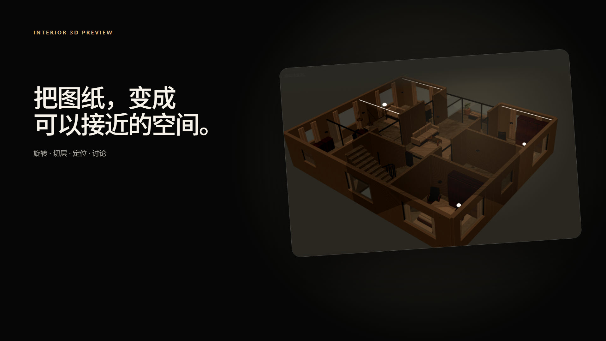

# Interior Renovation HTML

<p align="center">
  <a href="docs/skill-intro-slides.html">
    
  </a>
</p>

<p align="center"><strong>分层图纸 + DESIGN QA + 风格参考 → 可核对的 3D、逐房间效果图与单文件 HTML</strong></p>

<p align="center">
  <a href="SKILL.md">Skill 说明</a> ·
  <a href="docs/skill-intro-slides.html">交互式 Slides</a> ·
  <a href="example/output-html/room.html">完整示例</a> ·
  <a href="templates/DESIGN.template.md">填写 DESIGN QA</a>
</p>

## 它解决什么问题

这个 Skill 把 CAD 导出的住宅图纸、生活需求和风格参考，整理成一份可讨论、可追溯的装修概念方案。它不会把多层住宅当成同一套模型换标签：每一层都必须经过自己的图纸事实、房间台账、空间基线、3D 检查和效果图生成。

| 输入物件 | 决定什么 | 推荐文件 |
| --- | --- | --- |
| 分层图纸 | 墙体、门窗、楼梯、尺寸与房间关系 | `input/plan.pdf` |
| 生活问答 | 用途、家具尺寸、预算、禁忌与待确认项 | `input/DESIGN.md` |
| 风格参考 | 色调、材料、灯光与家具语言 | `input/style-reference.png` |

## 从证据到交付

流程分为四步：读取分层图纸与 QA，建立每层独立空间基线，生成对应的 3D 与逐房间效果图，最后校验并交付响应式 HTML。

<table>
  <tr>
    <td width="50%">
      <a href="docs/skill-intro-video/output/2d/floorplan-to-renovation-preview-2d-web.mp4">
        
      </a>
      <br /><strong>01 · 读图与建立分层基线</strong><br />逐页核对事实、需求、推断与待确认项。
    </td>
    <td width="50%">
      <a href="docs/skill-intro-video/output/3d/floorplan-to-renovation-preview-3d-web.mp4">
        
      </a>
      <br /><strong>02 · 独立建模与网页交付</strong><br />输出 Blender、Web GLB、房间渲染和最终 HTML。
    </td>
  </tr>
</table>

三层住宅必须按各自图纸独立建模；最终 HTML 可包含原始图纸、逐房间说明、交互式 3D、门窗对比、Imagen 效果图、材料预算、采购关键词与定位留言。

## 快速开始

1. 将 `plan.pdf`、`style-reference.png` 和填写后的 [`DESIGN.md`](templates/DESIGN.template.md) 放入同一个 `input/` 目录。
2. 调用 `$interior-renovation-html`，说明设计范围及是否需要 3D、效果图、预算和公开预览。
3. 在浏览器检查最终 HTML 的楼层切换、图纸、3D、图片、留言定位和移动端布局。

> 当前 `example/output-html/room.html` 是整屋视觉工作快照，需要按最新输出合同补齐 room ledger、review anchor 与逐层容器标记，并重新通过 validator 后，才能作为正式客户交付。`assets/example-third-floor/output/` 是稳定的回归 fixture。

```powershell
# 校验真实交付
node scripts/validate-renovation-html.mjs path/to/result.html

# 校验仓库中的完整示例
node scripts/validate-renovation-html.mjs --allow-golden-example assets/example-third-floor/output/example-third-floor-renovation.html

# 本地查看可编辑 Blender 配套的网页模型
python -m http.server 8767 --directory example/output-blender/yj-home-blender-v9-stair-rebuild
```

## 仓库导航

- [`SKILL.md`](SKILL.md)：主流程、硬约束和阅读顺序。
- [`references/`](references/)：输入、数据、3D、材料、安全与输出合约。
- [`scripts/`](scripts/)：嵌图、校验、Blender 与发布辅助脚本。
- [`example/output-html/room.html`](example/output-html/room.html)：当前完整装修示例。
- [`example/output-blender/`](example/output-blender/)：可编辑 `.blend`、GLB 和逐层检查图。
- [`docs/`](docs/)：Slides、2D/3D 视频、分镜和传播素材。

## 使用边界

输出用于空间讨论和概念决策，不代替现场测量、结构计算、消防与报建文件、机电设计、施工图或承包商报价。涉及承重墙、外窗、楼梯、厨卫移位、防水和燃气时，必须保留条件说明并交由当地专业人员复核。
