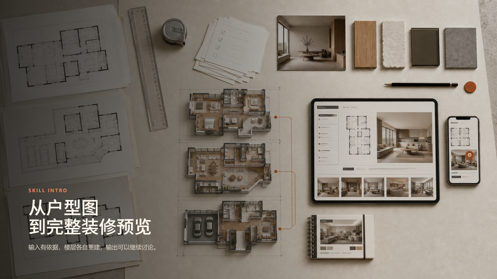
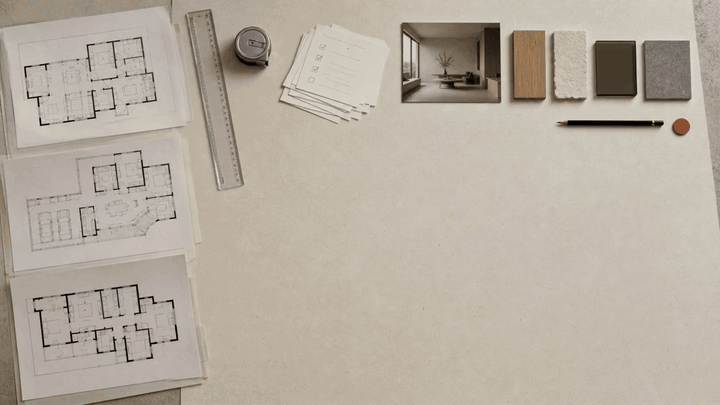

# Floor Plan to Renovation Preview

<p align="center">
  <a href="docs/skill-intro-slides.html">
    
  </a>
</p>

<p align="center"><strong>Floor-specific drawings + DESIGN Q&amp;A + style references → traceable 3D, room renders, and a single-file HTML report</strong></p>

<p align="center">
  <a href="README.zh-CN.md">中文</a> ·
  <a href="SKILL.md">Skill Guide</a> ·
  <a href="docs/skill-intro-slides.html">Interactive Slides</a> ·
  <a href="example/output-html/room.html">Complete Example</a> ·
  <a href="templates/DESIGN.template.md">DESIGN Q&amp;A Template</a>
</p>

## What It Solves

This skill turns CAD-exported residential plans, household requirements, and style references into a renovation concept that can be reviewed and traced back to evidence. A multi-floor home is never treated as one model with renamed tabs: every floor must have its own drawing facts, room ledger, spatial baseline, 3D inspection, and room renders.

## Usage Boundary

The output supports spatial discussion and concept decisions. It does not replace site measurement, structural calculations, fire or permit documents, MEP design, construction drawings, or contractor quotations. Changes involving load-bearing walls, exterior windows, stairs, kitchen or bathroom relocation, waterproofing, or gas systems must retain explicit conditions and be reviewed by qualified local professionals.

| Input object | What it determines | Suggested file |
| --- | --- | --- |
| Floor-specific drawings | Walls, openings, stairs, dimensions, and room relationships | `input/plan.pdf` |
| Household Q&amp;A | Use cases, furniture sizes, budget, restrictions, and unknowns | `input/DESIGN.md` |
| Style reference | Palette, materials, lighting, and furniture language | `input/style-reference.png` |

## From Evidence to Delivery

The workflow has four stages: read each drawing and the Q&amp;A, freeze an independent baseline for every floor, generate aligned 3D and room visuals, then validate and deliver a responsive HTML report.

<table>
  <tr>
    <td width="50%">
      <a href="docs/skill-intro-video/output/2d/floorplan-to-renovation-preview-2d-web.mp4">
        
      </a>
      <br /><strong>01 · Read drawings and establish baselines</strong><br />Separate drawing facts, requirements, inferences, and unresolved items.
    </td>
    <td width="50%">
      <a href="docs/skill-intro-video/output/3d/floorplan-to-renovation-preview-3d-web.mp4">
        
      </a>
      <br /><strong>02 · Model independently and deliver for the web</strong><br />Produce editable Blender, web GLB, room renders, and final HTML.
    </td>
  </tr>
</table>

The GIF previews autoplay on GitHub; click either preview for its higher-quality MP4. The [interactive Slides](docs/skill-intro-slides.html) retain native embedded video players.

## Quick Start

1. Put `plan.pdf`, `style-reference.png`, and the completed [`DESIGN.md`](templates/DESIGN.template.md) in one `input/` directory.
2. Invoke `$interior-renovation-html` and state whether the deliverable needs 3D, room renders, budget guidance, or a public preview.
3. Review floor switching, drawings, 3D, images, anchored notes, and the mobile layout in a browser.

```powershell
# Validate a real deliverable
node scripts/validate-renovation-html.mjs path/to/result.html

# Refresh and validate the complete example
node scripts/refresh-example-contract.mjs example/output-html/room.html
node scripts/validate-renovation-html.mjs example/output-html/room.html

# Serve the editable Blender companion preview
python -m http.server 8767 --directory example/output-blender/yj-home-blender-v9-stair-rebuild
```

## Repository Map

- [`SKILL.md`](SKILL.md): workflow, constraints, and required reading order.
- [`references/`](references/): input, data, 3D, material, safety, and output contracts.
- [`scripts/`](scripts/): embedding, validation, Blender, and publishing utilities.
- [`example/output-html/room.html`](example/output-html/room.html): validated whole-home example.
- [`example/output-blender/`](example/output-blender/): editable `.blend`, GLB, and per-floor inspection images.
- [`docs/`](docs/): Slides, 2D/3D videos, storyboards, and launch assets.
